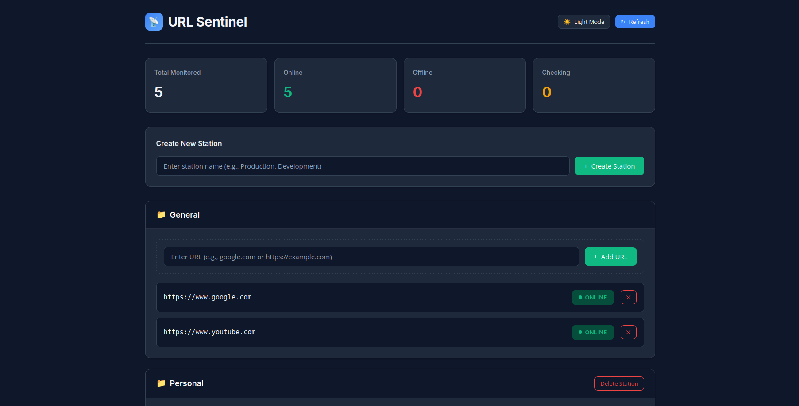
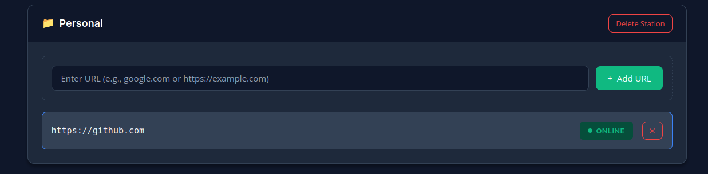

# URL Health Sentinel

A resilient, self-healing microservices application for monitoring website uptime, built with **Python**, **Redis**, and **Kubernetes**.

I built this project to explore Cloud Native architecture. It moves beyond simple scripts by decoupling the frontend from the backend worker and using a stateful database to ensure your data survives even if the application crashes.

---

## 📸 Screenshots

| **System Dashboard** | **Station Management** |
|:---:|:---:|
|  |  |

---

## 🧠 How It Works

The system follows a **Producer–Consumer architecture**:

### Sentinel (The Worker)

A headless Python service that runs in the background. It:

- Fetches your URLs  
- Checks their HTTP status codes  
- Writes the results to the database  

It disguises itself as a Chrome browser to avoid getting blocked by bot filters (like Wikipedia's).

### Dashboard (The Frontend)

A Flask web application where you can:

- View website statuses  
- Organize URLs into **"Stations"** (folders)

### Redis (The Database)

Acts as the message broker and storage layer.

- Uses **Persistent Volume Claims (PVC)**  
- Ensures your monitoring list is not lost even if the cluster restarts  

---

## ✨ Features

- **Station System** – Organize URLs into logical folders (e.g., *Work*, *Personal*, *Gaming*)
- **Real-Time Status** – Clear visual feedback for:
  - 🟢 UP  
  - 🔴 DOWN  
- **Self-Healing** – If the worker crashes, Kubernetes automatically restarts it
- **Data Persistence** – Data survives pod restarts via persistent volumes

---

## 📋 Prerequisites

To run the full infrastructure, you will need:

- Docker  
- Kind (Kubernetes in Docker) **or** Minikube  
- kubectl  

---

## 🚀 Getting Started

Two ways to run the application depending on your goals:

---

### Option 1: Kubernetes (The "Real" Way)

This is the intended production-style setup. It provides self-healing and scalability.

#### 1️⃣ Create the Cluster

A config file is included to map port 80 correctly:

```bash
kind create cluster --config kind-config.yaml --name sentinel-cluster
```

#### 2️⃣ Deploy the Stack

Apply all Kubernetes manifests (Deployments, Services, PVCs):

```bash
kubectl apply -f k8s/
```

#### 3️⃣ Access the Dashboard

Open your browser:

```
http://localhost
```

---

### Option 2: Docker Compose (The "Simple" Way)

If you just want to see the app running without spinning up Kubernetes:

```bash
docker-compose up --build
```

#### ⚠️ Limitations of Docker Compose

While easier to start, you lose Cloud Native benefits:

- **No Self-Healing**  
  If the Sentinel Python script crashes, Docker Compose will not restart it with Kubernetes-level intelligence.

- **No Rolling Updates**  
  You cannot perform zero-downtime updates like with Kubernetes Deployments.

---

## 📁 Project Structure

```
sentinel/   # Backend worker logic + Dockerfile
dashboard/  # Flask frontend application and templates
k8s/        # Kubernetes manifests (infrastructure as code)
```
